# Profiler
## Performance Profiling

Initial profiling was performed using **React DevTools Profiler**.

- **Tested interactions:**
    - Sorting a column
    - Searching for a country
    - Selecting a year
    - Adding/removing columns
<table>
    <thead>
        <tr>
            <th> Before optimisation </th>
            <th> After optimisation </th>
        </tr>
    </thead>
    <tbody>
        <tr>
            <td colspan="2" align="center"><h3>Filter by country</h3></td>
        </tr>
        <tr>
            <td colspan="2" align="center"><b>Flame Graph whith duration info</b></td>
        </tr>
        <tr>
            <td>
                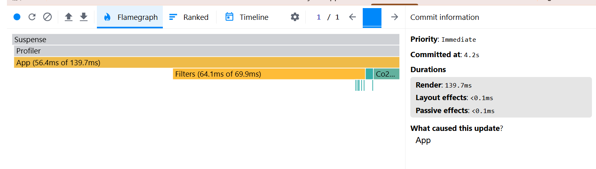
            </td>
            <td>
                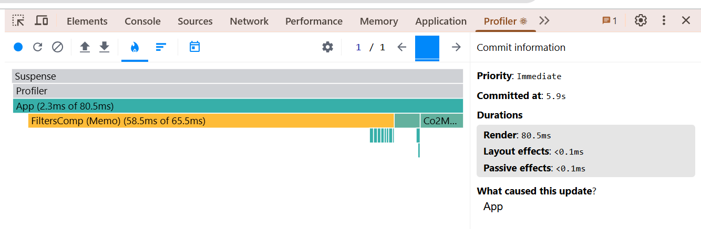
            </td>
        </tr>
        <tr>
            <td colspan="2" align="center"><b>Ranked Chart</b></td>
        </tr>
        <tr>
            <td>
                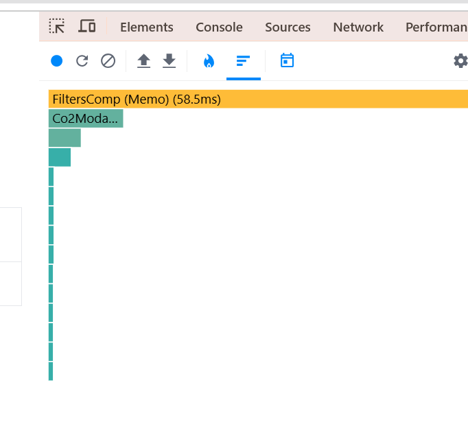
            </td>
            <td>
                
            </td>
        </tr>
       <tr>
            <td colspan="2" align="center"><h3>Search by year</h3></td>
        </tr>
        <tr>
            <td colspan="2" align="center"><b>Flame Graph with duration info</b></td>
        </tr>
        <tr>
            <td>
                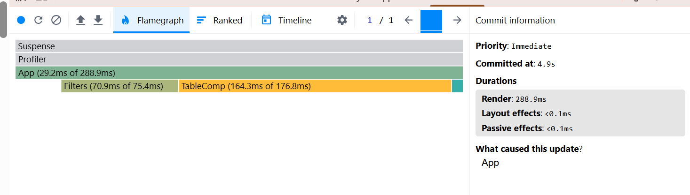
            </td>
            <td>
                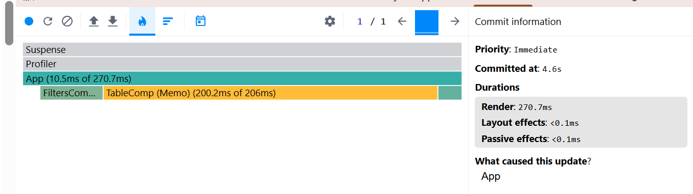
            </td>
        </tr>
        <tr>
            <td colspan="2" align="center"><b>Ranked Chart</b></td>
        </tr>
        <tr>
            <td>
                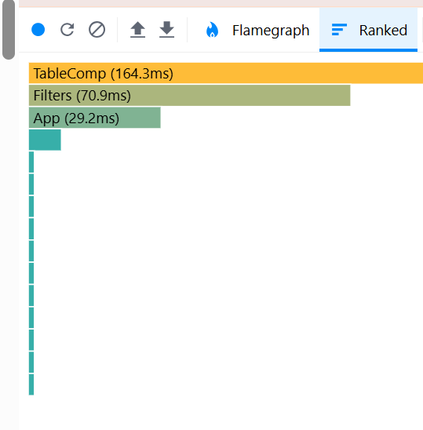
            </td>
            <td>
                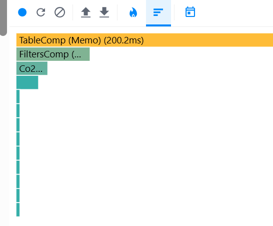
            </td>
        </tr>       <tr>
            <td colspan="2" align="center"><h3>Sorting</h3></td>
        </tr>
        <tr>
            <td colspan="2" align="center"><b>Flame Graph whith duration info</b></td>
        </tr>
        <tr>
            <td>
                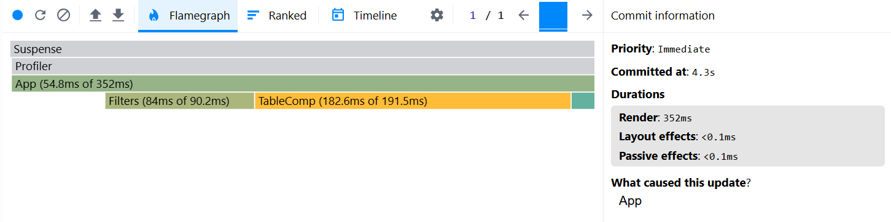
            </td>
            <td>
                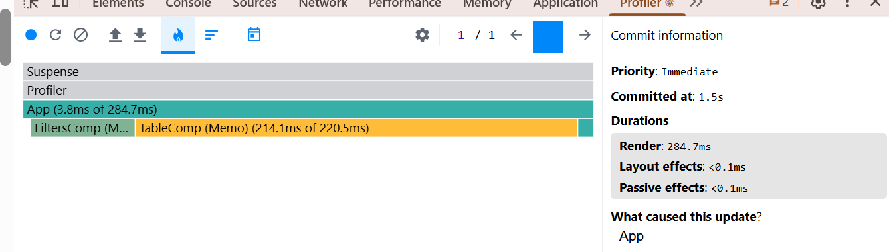
            </td>
        </tr>
        <tr>
            <td colspan="2" align="center"><b>Ranked Chart</b></td>
        </tr>
        <tr>
            <td>
                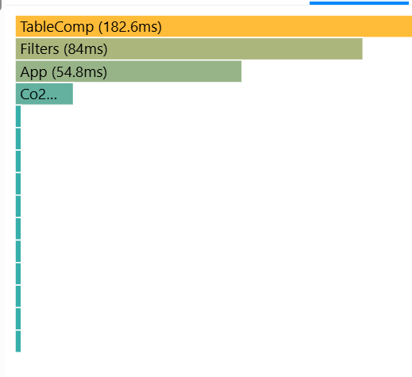
            </td>
            <td>
                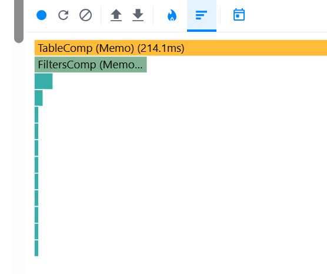
            </td>
        </tr>       <tr>
            <td colspan="2" align="center"><h3>Selecting columns</h3></td>
        </tr>
        <tr>
            <td colspan="2" align="center"><b>Flame Graph whith duration info</b></td>
        </tr>
        <tr>
            <td>
                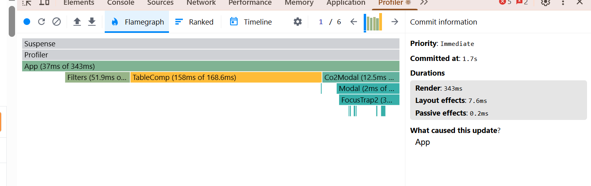
            </td>
            <td>
                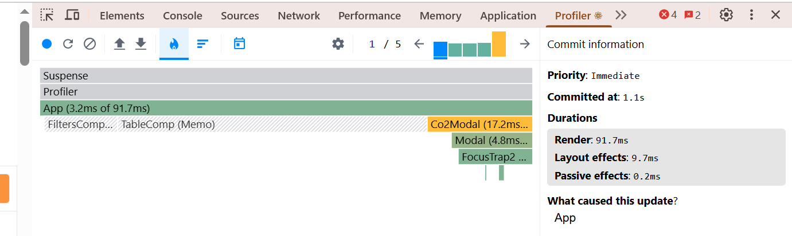
            </td>
        </tr>
        <tr>
            <td colspan="2" align="center"><b>Ranked Chart</b></td>
        </tr>
        <tr>
            <td>
                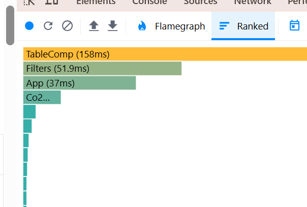
            </td>
            <td>
                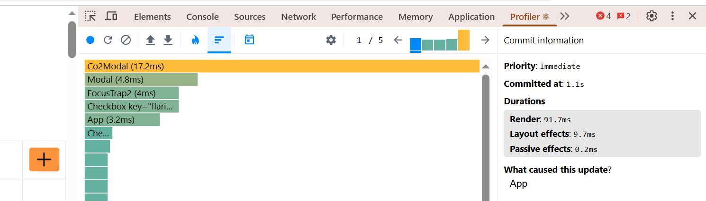
            </td>
        </tr>
    </tbody>
</table>
